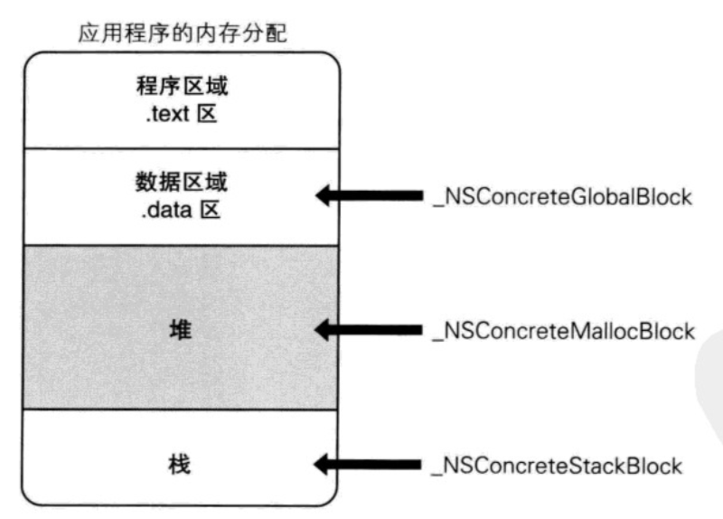
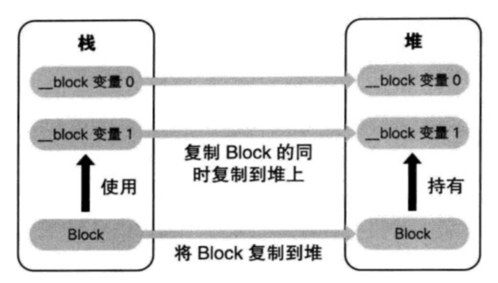
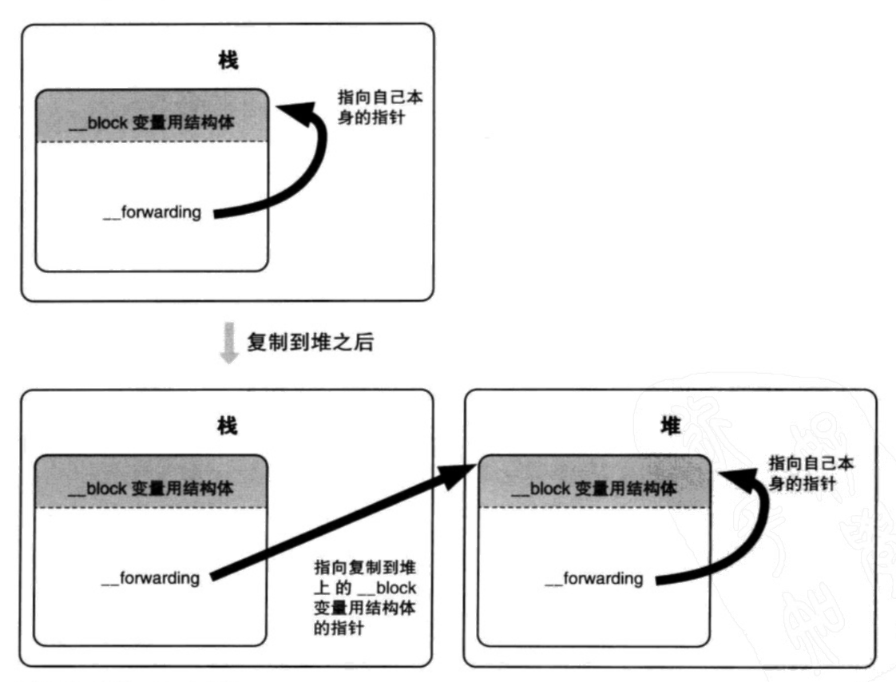
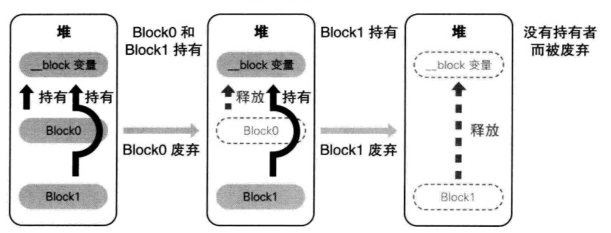

# 理解 Block 实现原理

> Block 是一种带有自动变量值的匿名函数。

 Block 在 iOS 日常开发中会频繁使用到，使用起来也十分方便，而它的实现原理和机制很多小伙伴却一无所知。 Block 是一种带有自动变量值的匿名函数，它能够自动捕获函数内使用到的参数，本文将从细节分析 Block 的实现原理。

## 一、Block 的实现

在探寻 Block 实现原理中，命令行工具``Clang``是非常实用的，它可以将其转换成 C++ 源码，方便我们了解其中的实现原理。

```
clang -rewrite-objc main.m
```

我们可以利用上面的命令，尝试将下面这段代码转换成 C++ 源码，进而分析 Block 的具体实现：

```
int main(int argc, const char * argv[]) {
    @autoreleasepool {
        int tempVar = 1;
        void (^blk)(void) = ^() {
            printf("Block var:%d\n", tempVar);
        };
        blk();    
    }
    return 0;
}
```

转换并剔除多余代码后如下：

```
struct __block_impl {
  void *isa;
  int Flags;
  int Reserved;
  void *FuncPtr;
};

struct __main_block_impl_0 {
  struct __block_impl impl;
  struct __main_block_desc_0* Desc;
  int tempVar;
  __main_block_impl_0(void *fp, struct __main_block_desc_0 *desc, int _tempVar, int flags=0) : tempVar(_tempVar) {
    impl.isa = &_NSConcreteStackBlock;
    impl.Flags = flags;
    impl.FuncPtr = fp;
    Desc = desc;
  }
};
static void __main_block_func_0(struct __main_block_impl_0 *__cself) {
  int tempVar = __cself->tempVar; // bound by copy
  printf("Block var:%d\n", tempVar);
}

static struct __main_block_desc_0 {
  size_t reserved;
  size_t Block_size;
} __main_block_desc_0_DATA = { 0, sizeof(struct __main_block_impl_0)};

int main(int argc, const char * argv[]) {
    /* @autoreleasepool */ { __AtAutoreleasePool __autoreleasepool; 

        int tempVar = 1;
        void (*blk)(void) = ((void (*)())&__main_block_impl_0((void *)__main_block_func_0, &__main_block_desc_0_DATA, tempVar));
        ((void (*)(__block_impl *))((__block_impl *)blk)->FuncPtr)((__block_impl *)blk);
    }
    return 0;
}
```

转换后得到了一大串代码，接下来我们一一分析这段代码的实际意义。

第一部分是``__block_impl``，它是``Block``实现的最底层的结构体：

```
struct __block_impl {
  void *isa;
  int Flags;
  int Reserved;
  void *FuncPtr;
};
```

* isa：表明具有它和对象一样特性。
* Flag：为状态标志位。
* Reserved：升级预留内存大小。
* FuncPtr：函数指针。

第二部分``__main_block_desc_0``是一个管理``Block``内存占用大小的结构体：

```
static struct __main_block_desc_0 {
  size_t reserved;
  size_t Block_size;
} __main_block_desc_0_DATA = { 0, sizeof(struct __main_block_impl_0)};
```

* Reserved：升级预留内存大小。
* Block_size：Block 的大小。

第三部分为``Block``实现结构体：

```
struct __main_block_impl_0 {
  struct __block_impl impl;
  struct __main_block_desc_0* Desc;
  int tempVar;
  __main_block_impl_0(void *fp, struct __main_block_desc_0 *desc, int _tempVar, int flags=0) : tempVar(_tempVar) {
    impl.isa = &_NSConcreteStackBlock;
    impl.Flags = flags;
    impl.FuncPtr = fp;
    Desc = desc;
  }
};
```
该结构体的命名逻辑为``__函数名_block_impl_函数内顺序``，接下来查看结构体成员：

* impl：为``__block_impl``类型结构体，参考第一部分。
* Desc：为``__main_block_impl_0``结构体实例大小。
* tempVar：捕获的自动变量值。
* \_\_main\_block\_impl\_0：为``__main_block_impl_0``结构体的构造函数。

第四部分为``Block``的函数指针指向的函数``__main_block_func_0``：

```
static void __main_block_func_0(struct __main_block_impl_0 *__cself) {
  int tempVar = __cself->tempVar; // bound by copy
  printf("Block var:%d\n", tempVar);
}
```

``__main_block_impl_0``结构体中将捕获的自动变量值作为成员变量，调用时先获取结构体成员变量的值，然后复制使用。

第五部分为``main``函数转换后源码：

```
int main(int argc, const char * argv[]) {
    /* @autoreleasepool */ { __AtAutoreleasePool __autoreleasepool; 

        int tempVar = 1;
        void (*blk)(void) = ((void (*)())&__main_block_impl_0((void *)__main_block_func_0, &__main_block_desc_0_DATA, tempVar));
        ((void (*)(__block_impl *))((__block_impl *)blk)->FuncPtr)((__block_impl *)blk);
    }
    return 0;
}
```

除了一个局部变量``tempVar``之外，另外 2 行代码分别是``Block``的的初始化部分和调用部分。去除部分类型强转代码后如下：

```
void (*blk)(void) = &__main_block_impl_0(__main_block_func_0, &__main_block_desc_0_DATA));
(blk->FuncPtr)(blk);
```

第一行代码是将前面声明的``__main_block_func_0``和``&__main_block_desc_0_DATA``传入构造函数，得到``blk``结构体实例。

第二行代码则是调用``blk``的函数指针。


## 二、捕获变量值

### 2.1 自动变量

在 Block 中使用外部的局部变量时，会自动捕获该变量并且成为 Block 结构体的成员变量，以便在 Block 内部访问该变量。除此之外，有其他几种方式可以访问外部变量，下面是变量类型和对应的作用域：

1. 自动变量：捕获至 Block 内。
2. 静态变量：作用域内可用。
3. 全局变量：整个程序可用。
4. 静态全局变量：当前文件可用。

通过将下面的代码转换至 C++ 代码，分析 Block 中各种类型变量的访问方式：

```
static char globalVar[] = {"globalVar"};
static char globalStaticVar[] = {"globalStaticVar"};

void catchVar() {
    int var1 = 1;
    int var2 = 2;
    static char staticVar[] = {"staticVar"};
    
    void (^blk)(void) = ^{
        printf("%d\n", var1);
        printf("%s\n", staticVar);
        printf("%s\n", globalVar);
        printf("%s\n", globalStaticVar);
    };
    blk();
}
```

上面的代码分别使用了局部变量、静态变量、全局变量和静态全局变量，其转换后的代码：

```
struct __catchVar_block_impl_0 {
  struct __block_impl impl;
  struct __catchVar_block_desc_0* Desc;
  int var1; // 局部变量
  char (*staticVar)[10]; // 静态变量
  __catchVar_block_impl_0(void *fp, struct __catchVar_block_desc_0 *desc, int _var1, char (*_staticVar)[10], int flags=0) : var1(_var1), staticVar(_staticVar) {
    impl.isa = &_NSConcreteStackBlock;
    impl.Flags = flags;
    impl.FuncPtr = fp;
    Desc = desc;
  }
};
static void __catchVar_block_func_0(struct __catchVar_block_impl_0 *__cself) {
  int var1 = __cself->var1; // bound by copy
  char (*staticVar)[10] = __cself->staticVar; // bound by copy

        printf("%d\n", var1);
        printf("%s\n", (*staticVar));
        printf("%s\n", globalVar);
        printf("%s\n", globalStaticVar);
    }

static struct __catchVar_block_desc_0 {
  size_t reserved;
  size_t Block_size;
} __catchVar_block_desc_0_DATA = { 0, sizeof(struct __catchVar_block_impl_0)};
void catchVar() {
    int var1 = 1;
    int var2 = 2;
    static char staticVar[] = {"staticVar"};

    void (*blk)(void) = ((void (*)())&__catchVar_block_impl_0((void *)__catchVar_block_func_0, &__catchVar_block_desc_0_DATA, var1, &staticVar));
    ((void (*)(__block_impl *))((__block_impl *)blk)->FuncPtr)((__block_impl *)blk);
}
```

通过``__catchVar_block_func_0``函数和 Block 构造函数可以知道各种变量的访问方式：

* **全局变量** 和 **静态全局变量** 因其作用域内都可以直接访问。
* **静态变量** 成为成员变量，但是从构造函数传入的是一个内存地址，然后通过地址访问。
* **局部变量** 成为成员变量，从构造函数直接传入变量的值并赋值给成员变量，然后通过成员变量访问。

### 2.2 对象

下面的代码中，Block 内使用了外部的一个对象，这种情况下 Block 内部是如何捕获该对象的呢？

```
void catchObject() {
    id obj = [NSObject new];
    
    void (^blk)(void) = ^{
        printf("%d\n", [obj hash]);
    };
    blk();
}
```

我们将上面的代码转换成 C++ 代码后分析其中实现原理：

```
struct __catchObject_block_impl_0 {
  struct __block_impl impl;
  struct __catchObject_block_desc_0* Desc;
  __strong id obj;
  __catchObject_block_impl_0(void *fp, struct __catchObject_block_desc_0 *desc, __strong id _obj, int flags=0) : obj(_obj) {
    impl.isa = &_NSConcreteStackBlock;
    impl.Flags = flags;
    impl.FuncPtr = fp;
    Desc = desc;
  }
};
static void __catchObject_block_func_0(struct __catchObject_block_impl_0 *__cself) {
  __strong id obj = __cself->obj; // bound by copy

        printf("%d\n", ((NSUInteger (*)(id, SEL))(void *)objc_msgSend)((id)obj, sel_registerName("hash")));
    }
static void __catchObject_block_copy_0(struct __catchObject_block_impl_0*dst, struct __catchObject_block_impl_0*src) {_Block_object_assign((void*)&dst->obj, (void*)src->obj, 3/*BLOCK_FIELD_IS_OBJECT*/);}

static void __catchObject_block_dispose_0(struct __catchObject_block_impl_0*src) {_Block_object_dispose((void*)src->obj, 3/*BLOCK_FIELD_IS_OBJECT*/);}

static struct __catchObject_block_desc_0 {
  size_t reserved;
  size_t Block_size;
  void (*copy)(struct __catchObject_block_impl_0*, struct __catchObject_block_impl_0*);
  void (*dispose)(struct __catchObject_block_impl_0*);
} __catchObject_block_desc_0_DATA = { 0, sizeof(struct __catchObject_block_impl_0), __catchObject_block_copy_0, __catchObject_block_dispose_0};


void catchObject() {
    id obj = ((NSObject *(*)(id, SEL))(void *)objc_msgSend)((id)objc_getClass("NSObject"), sel_registerName("new"));

    void (*blk)(void) = ((void (*)())&__catchObject_block_impl_0((void *)__catchObject_block_func_0, &__catchObject_block_desc_0_DATA, obj, 570425344));
    ((void (*)(__block_impl *))((__block_impl *)blk)->FuncPtr)((__block_impl *)blk);
}
```

首先来看``catchObject()``函数，在构建 blk 时，传入了对象``obj``和十进制标志位``570425344``。

```
void (*blk)(void) = ((void (*)())&__catchObject_block_impl_0((void *)__catchObject_block_func_0, &__catchObject_block_desc_0_DATA, obj, 570425344));
```

Block 结构体中成员变量``obj``为``__strong``修饰符，传入的对象``obj``直接赋值给成员变量，说明是直接使用原对象并且使引用计数 +1 。

其次是源代码中新增了两个方法，分别是``__catchObject_block_copy_0``和``__catchObject_block_dispose_0``，而这两个方法又分别调用了``_Block_object_assign``和``_Block_object_dispose``方法，这两个方法是用来管理 Block 中变量存储的，后面会进行分析。

```
static void __catchObject_block_copy_0(struct __catchObject_block_impl_0*dst, struct __catchObject_block_impl_0*src) {
  _Block_object_assign((void*)&dst->obj, (void*)src->obj, 3/*BLOCK_FIELD_IS_OBJECT*/);
}

static void __catchObject_block_dispose_0(struct __catchObject_block_impl_0*src) {
  _Block_object_dispose((void*)src->obj, 3/*BLOCK_FIELD_IS_OBJECT*/);
}
```


### 2.3 Block

将一个 Block 作为另外一个 Block 内的参数来使用，接下来分析这种情况下 Block 的实现。

```
void catchBlock() {
    void (^block)(void) = ^{};
    void (^blk)(void) = ^{
        block;
    };
    blk();
}
```

转换后代码如下：

```
struct __catchBlock_block_impl_0 {
  struct __block_impl impl;
  struct __catchBlock_block_desc_0* Desc;
  __catchBlock_block_impl_0(void *fp, struct __catchBlock_block_desc_0 *desc, int flags=0) {
    impl.isa = &_NSConcreteStackBlock;
    impl.Flags = flags;
    impl.FuncPtr = fp;
    Desc = desc;
  }
};
static void __catchBlock_block_func_0(struct __catchBlock_block_impl_0 *__cself) {
}

static struct __catchBlock_block_desc_0 {
  size_t reserved;
  size_t Block_size;
} __catchBlock_block_desc_0_DATA = { 0, sizeof(struct __catchBlock_block_impl_0)};

struct __catchBlock_block_impl_1 {
  struct __block_impl impl;
  struct __catchBlock_block_desc_1* Desc;
  struct __block_impl *block;
  __catchBlock_block_impl_1(void *fp, struct __catchBlock_block_desc_1 *desc, void *_block, int flags=0) : block((struct __block_impl *)_block) {
    impl.isa = &_NSConcreteStackBlock;
    impl.Flags = flags;
    impl.FuncPtr = fp;
    Desc = desc;
  }
};
static void __catchBlock_block_func_1(struct __catchBlock_block_impl_1 *__cself) {
  void (*block)() = (void (*)())__cself->block; // bound by copy

        block;
    }
static void __catchBlock_block_copy_1(struct __catchBlock_block_impl_1*dst, struct __catchBlock_block_impl_1*src) {_Block_object_assign((void*)&dst->block, (void*)src->block, 7/*BLOCK_FIELD_IS_BLOCK*/);}

static void __catchBlock_block_dispose_1(struct __catchBlock_block_impl_1*src) {_Block_object_dispose((void*)src->block, 7/*BLOCK_FIELD_IS_BLOCK*/);}

static struct __catchBlock_block_desc_1 {
  size_t reserved;
  size_t Block_size;
  void (*copy)(struct __catchBlock_block_impl_1*, struct __catchBlock_block_impl_1*);
  void (*dispose)(struct __catchBlock_block_impl_1*);
} __catchBlock_block_desc_1_DATA = { 0, sizeof(struct __catchBlock_block_impl_1), __catchBlock_block_copy_1, __catchBlock_block_dispose_1};

void catchBlock() {
    void (*block)(void) = ((void (*)())&__catchBlock_block_impl_0((void *)__catchBlock_block_func_0, &__catchBlock_block_desc_0_DATA));
    void (*blk)(void) = ((void (*)())&__catchBlock_block_impl_1((void *)__catchBlock_block_func_1, &__catchBlock_block_desc_1_DATA, (void *)block, 570425344));
    ((void (*)(__block_impl *))((__block_impl *)blk)->FuncPtr)((__block_impl *)blk);
}
```

同样的先看``catchBlock()``函数，其中 Block 构造函数中传入了``block``和标志位``570425344``，赋值给在``__catchBlock_block_impl_1``结构体中的一个``__block_impl``类型的结构体成员变量``block``。

```
void (*blk)(void) = ((void (*)())&__catchBlock_block_impl_1((void *)__catchBlock_block_func_1, &__catchBlock_block_desc_1_DATA, (void *)block, 570425344));
```

在这段代码中同样有``__catchObject_block_copy_0``和``__catchObject_block_dispose_0``两个方法，不同的是调用``_Block_object_assign``和``_Block_object_dispose``方法时最后一个入参为``7 /*BLOCK_FIELD_IS_BLOCK*/``，之前的捕获对象时传入的参数是``3 /*BLOCK_FIELD_IS_OBJECT*/``。

```
static void __catchBlock_block_copy_1(struct __catchBlock_block_impl_1*dst, struct __catchBlock_block_impl_1*src) {
  _Block_object_assign((void*)&dst->block, (void*)src->block, 7/*BLOCK_FIELD_IS_BLOCK*/);
}

static void __catchBlock_block_dispose_1(struct __catchBlock_block_impl_1*src) {
  _Block_object_dispose((void*)src->block, 7/*BLOCK_FIELD_IS_BLOCK*/);
}
```

### 2.4 __block 修饰的变量

Block 将外部的变量捕获后，可以在内部访问外部的变量，但是还不能修改外部变量的值（静态变量、全局变量和静态全局变量可以直接修改）。这个时候需要使用 __block 修饰符，使得在 Block 内部也可以修改 \_\_block 修饰符修饰的变量。

下面通过转换源码来分析实现原理：

```
void catchBlockVar() {
    __block int blockVar = 1;
    
    void (^blk)(void) = ^{
        blockVar = 2;
        printf("%d\n", blockVar);
    };
    blk();
}
```

转换后：

```
struct __Block_byref_blockVar_0 {
  void *__isa;
__Block_byref_blockVar_0 *__forwarding;
 int __flags;
 int __size;
 int blockVar;
};

struct __catchBlockVar_block_impl_0 {
  struct __block_impl impl;
  struct __catchBlockVar_block_desc_0* Desc;
  __Block_byref_blockVar_0 *blockVar; // by ref
  __catchBlockVar_block_impl_0(void *fp, struct __catchBlockVar_block_desc_0 *desc, __Block_byref_blockVar_0 *_blockVar, int flags=0) : blockVar(_blockVar->__forwarding) {
    impl.isa = &_NSConcreteStackBlock;
    impl.Flags = flags;
    impl.FuncPtr = fp;
    Desc = desc;
  }
};
static void __catchBlockVar_block_func_0(struct __catchBlockVar_block_impl_0 *__cself) {
  __Block_byref_blockVar_0 *blockVar = __cself->blockVar; // bound by ref

        (blockVar->__forwarding->blockVar) = 2;
        printf("%d\n", (blockVar->__forwarding->blockVar));
}
    
static void __catchBlockVar_block_copy_0(struct __catchBlockVar_block_impl_0*dst, struct __catchBlockVar_block_impl_0*src) {_Block_object_assign((void*)&dst->blockVar, (void*)src->blockVar, 8/*BLOCK_FIELD_IS_BYREF*/);}

static void __catchBlockVar_block_dispose_0(struct __catchBlockVar_block_impl_0*src) {_Block_object_dispose((void*)src->blockVar, 8/*BLOCK_FIELD_IS_BYREF*/);}

static struct __catchBlockVar_block_desc_0 {
  size_t reserved;
  size_t Block_size;
  void (*copy)(struct __catchBlockVar_block_impl_0*, struct __catchBlockVar_block_impl_0*);
  void (*dispose)(struct __catchBlockVar_block_impl_0*);
} __catchBlockVar_block_desc_0_DATA = { 0, sizeof(struct __catchBlockVar_block_impl_0), __catchBlockVar_block_copy_0, __catchBlockVar_block_dispose_0};


void catchBlockVar() {
    __attribute__((__blocks__(byref))) __Block_byref_blockVar_0 blockVar = {(void*)0,(__Block_byref_blockVar_0 *)&blockVar, 0, sizeof(__Block_byref_blockVar_0), 1};

    void (*blk)(void) = ((void (*)())&__catchBlockVar_block_impl_0((void *)__catchBlockVar_block_func_0, &__catchBlockVar_block_desc_0_DATA, (__Block_byref_blockVar_0 *)&blockVar, 570425344));
    ((void (*)(__block_impl *))((__block_impl *)blk)->FuncPtr)((__block_impl *)blk);
}
```

和其他类型 Block 最大的不同就是多了一个结构体``__Block_byref_blockVar_0``，经过``__block``修饰符修饰的变量都会自动生成一个这样的结构体。

```
struct __Block_byref_blockVar_0 {
  void *__isa;
__Block_byref_blockVar_0 *__forwarding;
 int __flags;
 int __size;
 int blockVar;
};
```

* __isa：具体和对象一样的特性。
* __forwarding：在栈区且未被复制时指向自己，被复制到堆区后指向堆区的结构体。
* __flags：标志位。
* __size：结构体占用内存大小。
* blockVar：原变量值。

在``catchBlockVar``方法转换后，之前的``int``类型变量``blockVar``变成``__Block_byref_blockVar_0``类型结构体，然后将此结构体地址传入 Block 的构造函数中，因此 Block 自动生成的成员变量也为``__Block_byref_blockVar_0``类型。


```
void catchBlockVar() {
    __Block_byref_blockVar_0 blockVar = {(void*)0,(__Block_byref_blockVar_0 *)&blockVar, 0, sizeof(__Block_byref_blockVar_0), 1};

    void (*blk)(void) = (&__catchBlockVar_block_impl_0((void *)__catchBlockVar_block_func_0, &__catchBlockVar_block_desc_0_DATA, (__Block_byref_blockVar_0 *)&blockVar, 570425344));
    ((void (*)(__block_impl *))((__block_impl *)blk)->FuncPtr)((__block_impl *)blk);
}
```

在被 Block 被调用时，通过下面的代码可以发现，访问``blockVar``并不直接访问，而是通过其``__forwarding``来访问其原变量的值。这样可以在它被复制到堆区时，访问堆区中的结构体。为什么要优先访问堆区的结构体？栈区的对象在超出其作用域后会被释放，如果希望在作用域外使用就需要复制到堆区中。

```
static void __catchBlockVar_block_func_0(struct __catchBlockVar_block_impl_0 *__cself) {
  __Block_byref_blockVar_0 *blockVar = __cself->blockVar; // bound by ref

        (blockVar->__forwarding->blockVar) = 2;
        printf("%d\n", (blockVar->__forwarding->blockVar));
}
```


在这段代码中的``__catchObject_block_copy_0``和``__catchObject_block_dispose_0``两个方法中传入的参数是``8 /*BLOCK_FIELD_IS_BYREF*/``。


```
static void __catchBlockVar_block_copy_0(struct __catchBlockVar_block_impl_0*dst, struct __catchBlockVar_block_impl_0*src) {
  _Block_object_assign((void*)&dst->blockVar, (void*)src->blockVar, 8/*BLOCK_FIELD_IS_BYREF*/);
}

static void __catchBlockVar_block_dispose_0(struct __catchBlockVar_block_impl_0*src) {
  _Block_object_dispose((void*)src->blockVar, 8/*BLOCK_FIELD_IS_BYREF*/);
}
```


### 2.5 __block 修饰的对象

在 Block 使用``__block``修饰的变量和``__block``修饰的对象，其中内部实现是有一些细微区别的，通过下面的代码来进行分析。

```
void catchBlockObject() {
    
    __block NSObject *obj = [[NSObject alloc] init];
    blk_t block = ^ {
        obj;
    };
}
```

转换后：

```
struct __Block_byref_obj_1 {
  void *__isa;
__Block_byref_obj_1 *__forwarding;
 int __flags;
 int __size;
 void (*__Block_byref_id_object_copy)(void*, void*);
 void (*__Block_byref_id_object_dispose)(void*);
 NSObject *obj;
};

struct __catchBlockObject_block_impl_0 {
  struct __block_impl impl;
  struct __catchBlockObject_block_desc_0* Desc;
  __Block_byref_obj_1 *obj; // by ref
  __catchBlockObject_block_impl_0(void *fp, struct __catchBlockObject_block_desc_0 *desc, __Block_byref_obj_1 *_obj, int flags=0) : obj(_obj->__forwarding) {
    impl.isa = &_NSConcreteStackBlock;
    impl.Flags = flags;
    impl.FuncPtr = fp;
    Desc = desc;
  }
};
static void __catchBlockObject_block_func_0(struct __catchBlockObject_block_impl_0 *__cself) {
  __Block_byref_obj_1 *obj = __cself->obj; // bound by ref

        (obj->__forwarding->obj);
    }
static void __catchBlockObject_block_copy_0(struct __catchBlockObject_block_impl_0*dst, struct __catchBlockObject_block_impl_0*src) {_Block_object_assign((void*)&dst->obj, (void*)src->obj, 8/*BLOCK_FIELD_IS_BYREF*/);}

static void __catchBlockObject_block_dispose_0(struct __catchBlockObject_block_impl_0*src) {_Block_object_dispose((void*)src->obj, 8/*BLOCK_FIELD_IS_BYREF*/);}

static struct __catchBlockObject_block_desc_0 {
  size_t reserved;
  size_t Block_size;
  void (*copy)(struct __catchBlockObject_block_impl_0*, struct __catchBlockObject_block_impl_0*);
  void (*dispose)(struct __catchBlockObject_block_impl_0*);
} __catchBlockObject_block_desc_0_DATA = { 0, sizeof(struct __catchBlockObject_block_impl_0), __catchBlockObject_block_copy_0, __catchBlockObject_block_dispose_0};


void catchBlockObject() {

    __attribute__((__blocks__(byref))) __Block_byref_obj_1 obj = {(void*)0,(__Block_byref_obj_1 *)&obj, 33554432, sizeof(__Block_byref_obj_1), __Block_byref_id_object_copy_131, __Block_byref_id_object_dispose_131, ((NSObject *(*)(id, SEL))(void *)objc_msgSend)((id)((NSObject *(*)(id, SEL))(void *)objc_msgSend)((id)objc_getClass("NSObject"), sel_registerName("alloc")), sel_registerName("init"))};

    blk_t block = ((void (*)())&__catchBlockObject_block_impl_0((void *)__catchBlockObject_block_func_0, &__catchBlockObject_block_desc_0_DATA, (__Block_byref_obj_1 *)&obj, 570425344));
}
```

在声明的结构体``__Block_byref_obj_1``中，和之前不一样的是多了``__Block_byref_id_object_copy``和``__Block_byref_id_object_dispose``两个管理内存的方法。

```
struct __Block_byref_obj_1 {
  void *__isa;
__Block_byref_obj_1 *__forwarding;
 int __flags;
 int __size;
 void (*__Block_byref_id_object_copy)(void*, void*);
 void (*__Block_byref_id_object_dispose)(void*);
 NSObject *obj;
};
```

再看到``catchBlockObject()``函数中，被``__block``修饰符修饰的``obj``对象转换成``__Block_byref_obj_1``类型结构体。其中``copy``和``dispose``两个方法传入的``__Block_byref_id_object_copy_131``、``__Block_byref_id_object_dispose_131``两个静态方法。

```
void catchBlockObject() {

   __Block_byref_obj_1 obj = {(void*)0,(__Block_byref_obj_1 *)&obj, 33554432, sizeof(__Block_byref_obj_1), __Block_byref_id_object_copy_131, __Block_byref_id_object_dispose_131, ((NSObject *(*)(id, SEL))(void *)objc_msgSend)((id)((NSObject *(*)(id, SEL))(void *)objc_msgSend)((id)objc_getClass("NSObject"), sel_registerName("alloc")), sel_registerName("init"))};

    blk_t block = (&__catchBlockObject_block_impl_0((void *)__catchBlockObject_block_func_0, &__catchBlockObject_block_desc_0_DATA, (__Block_byref_obj_1 *)&obj, 570425344));
}
```

静态方法如下，在最后一个参数传入的是``131``，其实就是``3 + 128``。

```
static void __Block_byref_id_object_copy_131(void *dst, void *src) {
 _Block_object_assign((char*)dst + 40, *(void * *) ((char*)src + 40), 131);
}

static void __Block_byref_id_object_dispose_131(void *src) {
 _Block_object_dispose(*(void * *) ((char*)src + 40), 131);
}
```

通过下面这个枚举可以明白，为什么捕获不同类型的变量，需要不同的入参。根据入参不同，对捕获的变量复制和释放的操作都是不同的。``131``则表示``BLOCK_FIELD_IS_BYREF``|``BLOCK_BYREF_CALLER ``。

```
// Runtime support functions used by compiler when generating copy/dispose helpers

// Values for _Block_object_assign() and _Block_object_dispose() parameters
enum {
    // see function implementation for a more complete description of these fields and combinations
    BLOCK_FIELD_IS_OBJECT   =  3,  // id, NSObject, __attribute__((NSObject)), block, ...
    BLOCK_FIELD_IS_BLOCK    =  7,  // a block variable
    BLOCK_FIELD_IS_BYREF    =  8,  // the on stack structure holding the __block variable
    BLOCK_FIELD_IS_WEAK     = 16,  // declared __weak, only used in byref copy helpers
    BLOCK_BYREF_CALLER      = 128, // called from __block (byref) copy/dispose support routines.
};
```

Block 本身的 Copy / Dispose 方法入参还是``8 /*BLOCK_FIELD_IS_BYREF*/``。


## 三、Block 的存储域

Block 的存储域分为 3 种，分别为``_NSConcreteStackBlock``、``_NSConcreteGlobalBlock``和``_NSConcreteMallocBlock``。

* _NSConcreteStackBlock：栈区
* _NSConcreteGlobalBlock：数据区域（.data 区）
* _NSConcreteMallocBlock：堆区




### 3.1 _NSConcreteStackBlock

正常情况下，定义在类内部的 Block 在捕获了自动变量的情况下都是在栈区，可以通过下面的代码打印出其类型。但是在实际使用中都会定义后都会赋值给一个变量，这会导致实际使用用这个 Block 的时候已经变成``_NSConcreteMallocBlock``类型。

```
// block 使用了捕获的变量 tempVar
int main(int argc, const char * argv[]) {
    @autoreleasepool {
        int tempVar = 1;
        NSLog(@"Stack Block:%@\n", ^() {
            printf("Stack Block! %d\n", tempVar);
        });
    }
    return 0;
}

// printf：Stack Block:<__NSStackBlock__: 0x7ffeefbff4a0>
```


### 3.2 _NSConcreteGlobalBlock

在定义全局变量的区域定义的 Block 类型为``_NSConcreteGlobalBlock``，另外还有一种情况就是定义在类内部的 Block 在没有捕获任何自动变量时，也是``_NSConcreteGlobalBlock``类型。
 

```
// block 内未使用外部变量
int main(int argc, const char * argv[]) {
    @autoreleasepool {
        NSLog(@"Global Block:%@\n", ^() {
            printf("Global Block!\n");
        });
    }
    return 0;
}

// printf：Global Block:<__NSGlobalBlock__: 0x1000021c8>
```


### 3.3 _NSConcreteMallocBlock

因为 Block 捕获的 __block 变量存在栈区时，超出其作用域后则被释放。为了避免这种情况，Block 实现机制将 Block 从栈区复制到堆区，这样即使超出其作用域，堆区的 Block 和 \_\_block 变量依然存在。


在未被复制时，__block 变量``__forwarding``指向自身，被复制后指向堆区中的 __block 变量，这种机制使其无论是在堆区还是栈区都可以正确访问。


下面这些场景下编译器会自动处理将 Block 拷贝到堆上：

* ARC 有效时 block 作为函数或方法的返回值会自动被拷贝到堆上
* Cocoa 框架中的方法名包含 usingBlock 等时
* GCD 的 API
* 将 block 赋值给 __Strong 修饰符 id 类型对象或 Block 类型的成员变量时


以下场景需要手动拷贝至堆上

* 手动调用 block 实例方法 
    * 将 block 作为方法中的参数时需要开发者手动拷贝
    * 当将 block 放入数组并作为返回值时需要手动拷贝


## 四、 __block 变量的存储域

当 Block 从栈区被复制到堆区时，对应的``__block``修饰符修饰的变量也相应地被复制到堆区。




在前面的内容我们分析到``__block``修饰的变量会转换成一个结构体，结构体中含有成员变量``__forwarding``，复制到堆区后可以在 Block 变量超出其作用域使用，这个时候栈区结构体成员变量``__forwarding``指向堆区的结构体（在未被复制时指向自身结构体）。




当多个 Block 使用同一个 __block 变量时，复制已经在堆上的 \_\_block 变量引用计数会增加，当释放时也是将减引用计数减至 0 后才废弃该 \_\_block 变量。




## 五、\_Block\_object\_assign 和 \_Block\_object\_dispose

在第二章节中介绍了捕获不同类型的变量时，Block 调用``_Block_object_assign``函数的入参``flags``都不一样，下面来看看具体实现。

### 5.1 \_Block\_object\_assign

直接看实现源码：

```
void _Block_object_assign(void *destArg, const void *object, const int flags) {
    const void **dest = (const void **)destArg;
    switch (os_assumes(flags & BLOCK_ALL_COPY_DISPOSE_FLAGS)) {
      case BLOCK_FIELD_IS_OBJECT:
        /*******
        id object = ...;
        [^{ object; } copy];
        ********/

        _Block_retain_object(object);
        *dest = object;
        break;

      case BLOCK_FIELD_IS_BLOCK:
        /*******
        void (^object)(void) = ...;
        [^{ object; } copy];
        ********/

        *dest = _Block_copy(object);
        break;
    
      case BLOCK_FIELD_IS_BYREF | BLOCK_FIELD_IS_WEAK:
      case BLOCK_FIELD_IS_BYREF:
        /*******
         // copy the onstack __block container to the heap
         // Note this __weak is old GC-weak/MRC-unretained.
         // ARC-style __weak is handled by the copy helper directly.
         __block ... x;
         __weak __block ... x;
         [^{ x; } copy];
         ********/

        *dest = _Block_byref_copy(object);
        break;
        
      case BLOCK_BYREF_CALLER | BLOCK_FIELD_IS_OBJECT:
      case BLOCK_BYREF_CALLER | BLOCK_FIELD_IS_BLOCK:
        /*******
         // copy the actual field held in the __block container
         // Note this is MRC unretained __block only. 
         // ARC retained __block is handled by the copy helper directly.
         __block id object;
         __block void (^object)(void);
         [^{ object; } copy];
         ********/

        *dest = object;
        break;

      case BLOCK_BYREF_CALLER | BLOCK_FIELD_IS_OBJECT | BLOCK_FIELD_IS_WEAK:
      case BLOCK_BYREF_CALLER | BLOCK_FIELD_IS_BLOCK  | BLOCK_FIELD_IS_WEAK:
        /*******
         // copy the actual field held in the __block container
         // Note this __weak is old GC-weak/MRC-unretained.
         // ARC-style __weak is handled by the copy helper directly.
         __weak __block id object;
         __weak __block void (^object)(void);
         [^{ object; } copy];
         ********/

        *dest = object;
        break;

      default:
        break;
    }
}
```

由上面代码可知``_Block_object_assign``方法根据入参``flags``做了不同的处理，下面一一分析不同入参的处理方式：


#### 5.1.1 BLOCK\_FIELD\_IS\_OBJECT：复制对象
	
```
// 默认_Block_retain_object 被赋值为 _Block_retain_object_default 即什么都不做
_Block_retain_object(object); 
// 指针指向原对象内存地址。
*dest = object; 
```

``_Block_retain_object``方法在 ``_Block_use_RR2``被执行时才有实际意义。	
	
```
void _Block_use_RR2(const Block_callbacks_RR *callbacks) {
    _Block_retain_object = callbacks->retain;
    _Block_release_object = callbacks->release;
    _Block_destructInstance = callbacks->destructInstance;
}
```

#### 5.1.2 BLOCK\_FIELD\_IS\_BLOCK：复制 Block


分析``_Block_copy``的实现：

```
 //复制或碰撞引用计数。如果确实要复制，请调用复制助手（如果存在）。
void *_Block_copy(const void *arg) {
    struct Block_layout *aBlock;

    if (!arg) return NULL;
    
    aBlock = (struct Block_layout *)arg;
    // 已复制 则增加引用计数
    if (aBlock->flags & BLOCK_NEEDS_FREE) {
        // latches on high
        latching_incr_int(&aBlock->flags);
        return aBlock;
    }
    // 如果是全局 Block 则直接返回
    else if (aBlock->flags & BLOCK_IS_GLOBAL) {
        return aBlock;
    }
    // 进行复制
    else {
        // Its a stack block.  Make a copy.
        struct Block_layout *result =
            (struct Block_layout *)malloc(aBlock->descriptor->size);
        if (!result) return NULL;
        memmove(result, aBlock, aBlock->descriptor->size); // bitcopy first
#if __has_feature(ptrauth_calls)
        // Resign the invoke pointer as it uses address authentication.
        result->invoke = aBlock->invoke;
#endif
        // reset refcount
        result->flags &= ~(BLOCK_REFCOUNT_MASK|BLOCK_DEALLOCATING);    // XXX not needed
        result->flags |= BLOCK_NEEDS_FREE | 2;  // logical refcount 1
        _Block_call_copy_helper(result, aBlock);
        result->isa = _NSConcreteMallocBlock;
        return result;
    }
}
```

#### 5.1.3 BLOCK\_FIELD\_IS\_BYREF：复制 _block 变量


分析``_Block_byref_copy``的实现：

```
static struct Block_byref *_Block_byref_copy(const void *arg) {
    struct Block_byref *src = (struct Block_byref *)arg;

    if ((src->forwarding->flags & BLOCK_REFCOUNT_MASK) == 0) {
        // 复制 Block_byref
        struct Block_byref *copy = (struct Block_byref *)malloc(src->size);
        copy->isa = NULL;
        // byref value 4 is logical refcount of 2: one for caller, one for stack
        copy->flags = src->flags | BLOCK_BYREF_NEEDS_FREE | 4;
        copy->forwarding = copy; // patch heap copy to point to itself
        src->forwarding = copy;  // patch stack to point to heap copy
        copy->size = src->size;

        if (src->flags & BLOCK_BYREF_HAS_COPY_DISPOSE) {
        
            // 复制 Block_byref2，含有 copy / dispose 方法的变量需要执行这部分代码
            
            struct Block_byref_2 *src2 = (struct Block_byref_2 *)(src+1);
            struct Block_byref_2 *copy2 = (struct Block_byref_2 *)(copy+1);
            copy2->byref_keep = src2->byref_keep;
            copy2->byref_destroy = src2->byref_destroy;

            if (src->flags & BLOCK_BYREF_LAYOUT_EXTENDED) {
                // 复制 Block_byref3
                struct Block_byref_3 *src3 = (struct Block_byref_3 *)(src2+1);
                struct Block_byref_3 *copy3 = (struct Block_byref_3*)(copy2+1);
                copy3->layout = src3->layout;
            }

            (*src2->byref_keep)(copy, src);
        }
        else {
            // Bitwise copy.
            // This copy includes Block_byref_3, if any.
            memmove(copy+1, src+1, src->size - sizeof(*src));
        }
    }
    // 已经复制到堆上的 引用计数 +1
    else if ((src->forwarding->flags & BLOCK_BYREF_NEEDS_FREE) == BLOCK_BYREF_NEEDS_FREE) {
        latching_incr_int(&src->forwarding->flags);
    }
    
    return src->forwarding;
}
```

#### 5.1.4 其他

在其他情况下都是直接指针指向原对象地址：

```
*dest = object;
```


### 5.2 \_Block\_object\_dispose

下面是 Block 捕获变量的释放逻辑：

```
void _Block_object_dispose(const void *object, const int flags) {
    switch (os_assumes(flags & BLOCK_ALL_COPY_DISPOSE_FLAGS)) {
      case BLOCK_FIELD_IS_BYREF | BLOCK_FIELD_IS_WEAK:
      case BLOCK_FIELD_IS_BYREF:
        // get rid of the __block data structure held in a Block
        _Block_byref_release(object);
        break;
      case BLOCK_FIELD_IS_BLOCK:
        _Block_release(object);
        break;
      case BLOCK_FIELD_IS_OBJECT:
        _Block_release_object(object);
        break;
      case BLOCK_BYREF_CALLER | BLOCK_FIELD_IS_OBJECT:
      case BLOCK_BYREF_CALLER | BLOCK_FIELD_IS_BLOCK:
      case BLOCK_BYREF_CALLER | BLOCK_FIELD_IS_OBJECT | BLOCK_FIELD_IS_WEAK:
      case BLOCK_BYREF_CALLER | BLOCK_FIELD_IS_BLOCK  | BLOCK_FIELD_IS_WEAK:
        break;
      default:
        break;
    }
}
```

#### 5.2.1 BLOCK\_FIELD\_IS\_BYREF：释放 _block 变量

分析``_Block_byref_release``的实现：

```
static void _Block_byref_release(const void *arg) {
    struct Block_byref *byref = (struct Block_byref *)arg;

    // dereference the forwarding pointer since the compiler isn't doing this anymore (ever?)
    byref = byref->forwarding;
    // 判断是否被复制到堆上
    if (byref->flags & BLOCK_BYREF_NEEDS_FREE) {
        int32_t refcount = byref->flags & BLOCK_REFCOUNT_MASK;
        os_assert(refcount);
        // 引用计数 -1 后判断是否要进行释放操作
        if (latching_decr_int_should_deallocate(&byref->flags)) {
            // 判断这个变量是否有 copy / dispose 方法
            if (byref->flags & BLOCK_BYREF_HAS_COPY_DISPOSE) {
                struct Block_byref_2 *byref2 = (struct Block_byref_2 *)(byref+1);
                (*byref2->byref_destroy)(byref);
            }
            free(byref);
        }
    }
}
```

需要根据 _block 变量成员变量和标志位来判断释放步骤。


#### 5.2.2 BLOCK\_FIELD\_IS\_BLOCK：释放 Block

分析``_Block_release``的实现：


```
void _Block_release(const void *arg) {
    struct Block_layout *aBlock = (struct Block_layout *)arg;
    if (!aBlock) return;
    if (aBlock->flags & BLOCK_IS_GLOBAL) return;
    if (! (aBlock->flags & BLOCK_NEEDS_FREE)) return;
    // 全局 Block 和 栈上的 Block 直接返回
    
    // Block 引用计数 -1 后判断是否需要进行释放
    if (latching_decr_int_should_deallocate(&aBlock->flags)) {
        _Block_call_dispose_helper(aBlock);
        _Block_destructInstance(aBlock);
        free(aBlock);
    }
}
```


#### 5.2.3 BLOCK\_FIELD\_IS\_OBJECT：释放对象


```
_Block_release_object(object);
```

``_Block_release_object``方法在 ARC 环境下无操作，和``_Block_retain_object``一样。


## 六、循环引用

一个 Block 作为类的成员变量的同时，Block 内部还使用了类实例的情况下会引发循环引用。在这种情况下，类实例持有成员变量 block ，block 持有成员变量 __block 变量，\_\_block 变量结构体持有类实例，形成一个三角循环引用关系。

```
__block id tmp = self;
blk = ^{
  NSLog(@"self = %@", tmp);
}
```

解决循环引用的方法有 2 种，一种是使用 __weak 修饰符，这种方法打破了\_\_block 变量结构体持有类实例的关系，从而避免循环引用。

```
__weak id tmp = self;
blk = ^{
  NSLog(@"self = %@", tmp);
}
```

还有一种情况是使用 __block 修饰符，然后 blk 调用函数最后一行将``tmp``手动置空，这种方法虽然也可以避免循环引用，但是一旦 blk 没有被调用的话，同样会造成循环引用。所以还是使用 \_\_weak 修饰符的方式更为安全。

```
__block id tmp = self;
blk = ^{
  NSLog(@"self = %@", tmp);
  tmp = nil;
}
```
